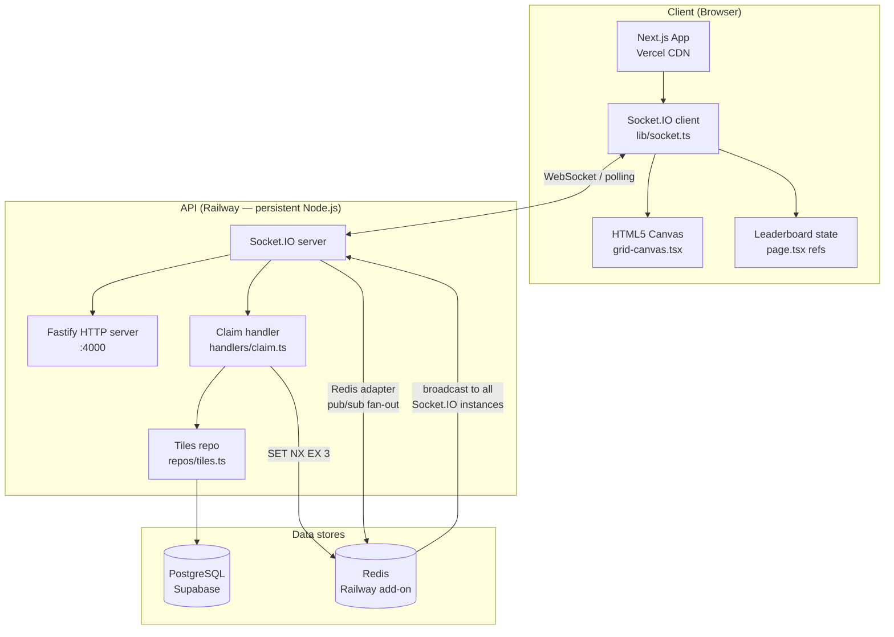
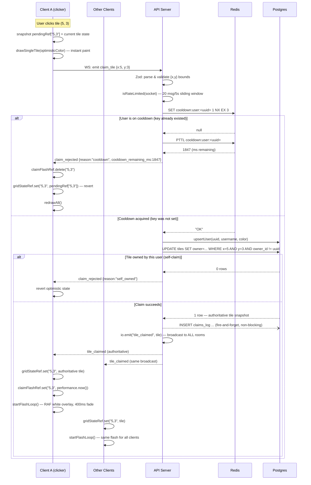
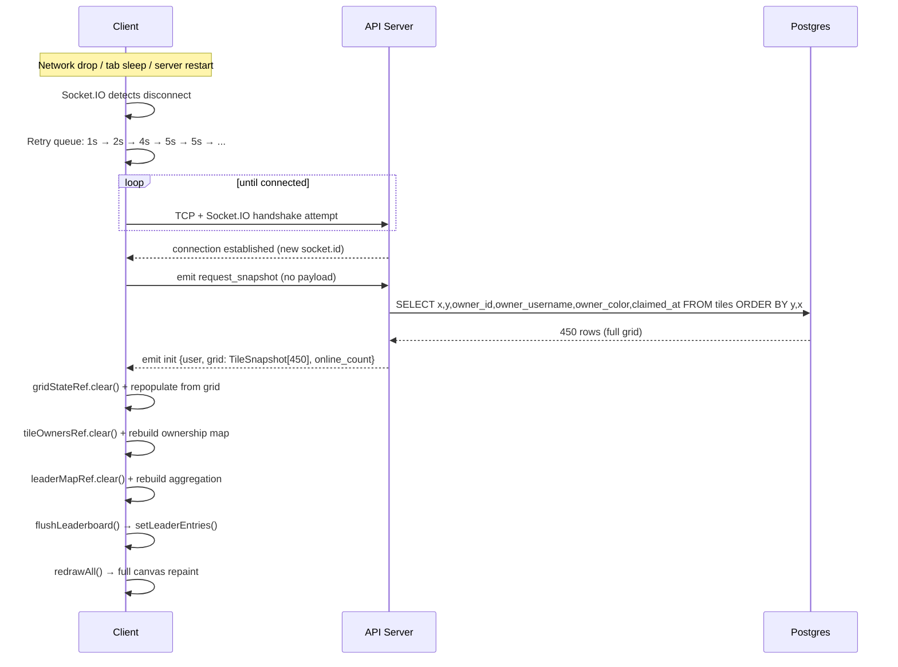
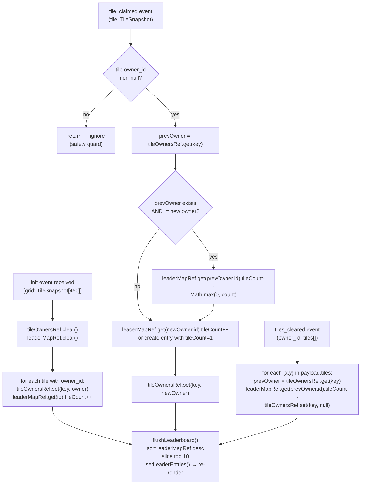
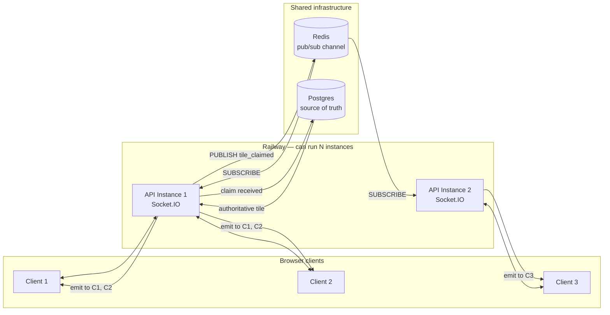

# Architecture

> **Quick orientation**
> - Read this first if you're new to the project — it maps every moving part and every data flow.
> - The claim lifecycle diagram is the most useful single reference: it shows exactly what happens between a mouse click and every browser updating.
> - For per-component deep dives, see the other docs files linked at the bottom.

---

## System component map



---

## Data flow: claim lifecycle

This is the most important flow in the system. Read it in full before touching the claim handler or the canvas component.



---

## Data flow: reconnect and state rehydration

The client never trusts its own cached state after a disconnect. It requests a fresh snapshot from the server, which is authoritative.



Note: during the disconnect window, `tile_claimed` events from other users are missed. The `request_snapshot` recovery closes that gap — the client gets authoritative state, not a partial diff.

---

## Leaderboard state machine

The leaderboard is computed client-side from socket events, with no backend queries.



---

## Concurrency model

Two users claiming the same tile simultaneously is the core conflict scenario. The system resolves it deterministically at the Postgres layer.

```
Timeline (microseconds)
──────────────────────────────────────────────────────────────────

t=0     User A clicks tile (5,3)         User B clicks tile (5,3)
        emit claim_tile                   emit claim_tile

t=1ms   A: Zod passes                    B: Zod passes
        A: rate limit passes             B: rate limit passes

t=2ms   A: Redis SET NX → OK             B: Redis SET NX → OK
        (key: cooldown:user:A)           (key: cooldown:user:B)
        ← different keys, both pass ─────────────────────────────

t=3ms   A: Postgres UPDATE begins         B: Postgres UPDATE begins

t=4ms   Postgres: A acquires row lock for tile (5,3)
                  B blocks — waiting for lock release

t=5ms   A: WHERE (owner_id IS NULL OR owner_id != A) → TRUE
        A: UPDATE succeeds — 1 row returned
        A: lock released

t=6ms   B: row lock acquired
        B: WHERE (owner_id IS NULL OR owner_id != B)
           → owner_id = A's id, and A's id != B's id → TRUE
        B: UPDATE succeeds — tile is now B's!

        ← WAIT — this is the "tile changed hands twice" case ────
        ← That is correct behaviour. If B was faster to DB,
           B wins. If A was faster, A wins. Postgres serializes it.

The "self_owned" path:
        If A claims, then A clicks again before cooldown expires:
        → Redis: cooldown key exists → claim_rejected immediately
        → Postgres never reached

The "lost race" path (only relevant if two users have no cooldown):
        If A is already owner_id = A and B claims:
        → B's UPDATE: WHERE owner_id != B → TRUE (owner is A ≠ B)
        → B wins legitimately. No dedup needed.

Key invariant:
        At most one io.emit('tile_claimed') fires per tile per claim window.
        Postgres RETURNING either gives 0 rows (no broadcast) or 1 row (one broadcast).
```

---

## Horizontal scaling

The Redis adapter is configured even though only one instance is deployed. This means scaling to multiple Railway instances requires no code changes.



When Instance 1 receives a claim and broadcasts `io.emit('tile_claimed')`, the Redis adapter publishes to a channel. Instance 2 is subscribed to that channel and re-broadcasts to its own connected clients. Postgres is the single source of truth — both instances read/write the same database.

---

## Key files and their responsibilities

| File | Responsibility |
|---|---|
| `apps/api/src/server.ts` | Startup, CORS, Socket.IO attach, Redis adapter, connection handler |
| `apps/api/src/handlers/claim.ts` | 5-layer claim validation and broadcast |
| `apps/api/src/repos/tiles.ts` | All SQL queries — getAllTiles, atomicClaimTile, clearUserTiles |
| `apps/api/src/lib/pg.ts` | pg.Pool configuration (SSL, timeouts, max connections) |
| `apps/api/src/lib/redis.ts` | Two Redis clients, tryAcquireCooldown |
| `apps/api/scripts/migrate.ts` | Idempotent schema apply + constraint normalization |
| `apps/web/app/page.tsx` | Root component — leaderboard state, socket listeners, sidebar tabs |
| `apps/web/components/grid-canvas.tsx` | Canvas rendering, pan/zoom, optimistic updates, RAF flash |
| `apps/web/lib/socket.ts` | Socket.IO singleton (HMR-safe), reconnection config |
| `apps/web/lib/grid-renderer.ts` | drawGrid, drawSingleTile, pixelToTile, tileToPixel |
| `packages/types/index.ts` | Shared TypeScript interfaces for all socket events |
| `schema.sql` | Database DDL + 450-tile grid seed |
| `railway.json` | Railway build pipeline + deploy config |

---

## If something looks wrong, start here

| Symptom | Where to look |
|---|---|
| Tile changes color on one client but not others | Redis adapter pub/sub — check `REDIS_URL` in Railway env vars |
| Two users both "win" the same tile | Postgres UPDATE — check if `owner_id != $1` WHERE clause is intact |
| Leaderboard count drifts from actual | `tileOwnersRef` — check guard clause `if (!tile.owner_id) return` in `handleTileClaimedForLeader` |
| Flash animation doesn't stop | `flashRafRef` — check that `cancelAnimationFrame` is called in useEffect cleanup |
| Reconnect doesn't restore grid | `request_snapshot` emit — check that socket `connected` check fires after re-register |
