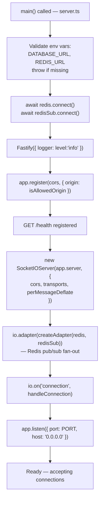
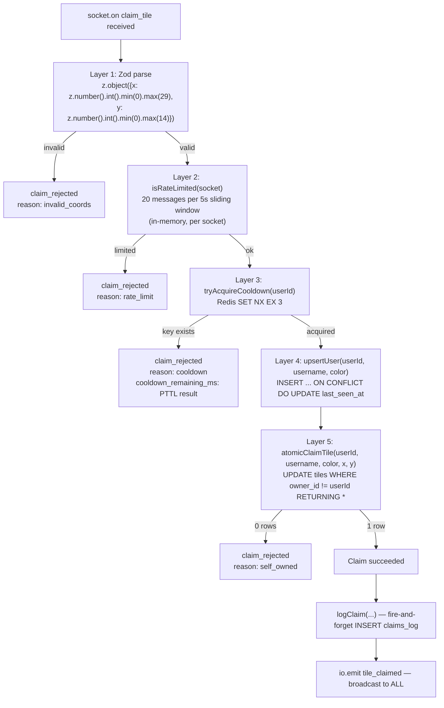

# Backend

> **Quick orientation**
> - This file covers everything inside `apps/api/` — the Fastify HTTP server, Socket.IO, the claim handler pipeline, Redis cooldowns, and Postgres access.
> - Start with the startup sequence to understand boot order, then the claim handler for the core logic.
> - For the WebSocket event contracts, see [websocket.md](./websocket.md). For database schema and queries, see [database.md](./database.md).

---

## Startup sequence



The env var check at boot gives a clear error message instead of a cryptic connection failure 10 seconds later:

```typescript
// apps/api/src/server.ts
const missingVars = ['DATABASE_URL', 'REDIS_URL'].filter((k) => !process.env[k]);
if (missingVars.length) {
  throw new Error(`Missing required environment variables: ${missingVars.join(', ')}`);
}
```

Redis must connect before Socket.IO starts — the adapter is attached synchronously after `io` is created, but it needs live Redis clients to subscribe to pub/sub channels.

---

## CORS configuration

Two CORS configs are required: one for Fastify (REST / HTTP polling) and one for the Socket.IO server (WebSocket upgrade). Using only one will cause preflight failures.

```typescript
// apps/api/src/server.ts

const ALLOWED_ORIGINS = (process.env.FRONTEND_URL ?? 'http://localhost:3000')
  .split(',')      // supports comma-separated list for multi-environment
  .map((s) => s.trim())
  .filter(Boolean);

function isAllowedOrigin(origin: string | undefined): boolean {
  if (!origin) return true;  // server-to-server, same-origin, health checks
  return ALLOWED_ORIGINS.includes(origin);
}

// Fastify CORS — covers HTTP polling and REST
await app.register(cors, {
  origin: (origin, cb) => cb(null, isAllowedOrigin(origin)),
  methods: ['GET', 'POST', 'OPTIONS'],
  credentials: true,
});

// Socket.IO CORS — covers WebSocket upgrade and polling
const io = new SocketIOServer(app.server, {
  cors: {
    origin: (origin, cb) => cb(null, isAllowedOrigin(origin)),
    methods: ['GET', 'POST'],
    credentials: true,
  },
  perMessageDeflate: true,
  transports: ['websocket', 'polling'],
});
```

**In production**, `FRONTEND_URL` on Railway is set to the Vercel domain:
```
FRONTEND_URL=https://inboxkit-assignment-web.vercel.app
```

For multiple origins (e.g. preview deployments):
```
FRONTEND_URL=https://myapp.vercel.app,https://myapp-preview.vercel.app
```

---

## Connection handler

Every new WebSocket connection goes through `handleConnection`. It runs once per socket and sets up the user's identity and all event listeners.

```typescript
async function handleConnection(io, socket): Promise<void> {
  // Generate anonymous identity — same algorithm every time, no DB lookup
  const base = uniqueNamesGenerator({
    dictionaries: [adjectives, animals],
    separator: '-',
    length: 2,
    style: 'lowerCase',
  });
  const username = `${base}-${Math.floor(Math.random() * 100)}`;  // e.g. "quiet-ferret-42"
  const userId = uuidv4();
  const color = usernameToColor(username);  // deterministic hash → palette index

  socket.data = { userId, username, color, msgTimestamps: [] };

  // Load full grid and emit init — client rebuilds state from this
  const grid = await getAllTiles();
  const onlineCount = io.sockets.sockets.size;
  socket.emit('init', { user: { id: userId, username, color }, grid, online_count: onlineCount });
  socket.broadcast.emit('user_joined', { online_count: onlineCount, username });

  registerClaimHandler(io, socket);

  socket.on('clear_my_tiles', () => {
    void clearUserTiles(socket.data.userId).then((tiles) => {
      if (tiles.length > 0) {
        io.emit('tiles_cleared', { owner_id: socket.data.userId, tiles });
      }
    });
  });

  socket.on('request_snapshot', () => {
    void getAllTiles().then((freshGrid) => {
      socket.emit('init', {
        user: { id: socket.data.userId, username: socket.data.username, color: socket.data.color },
        grid: freshGrid,
        online_count: io.sockets.sockets.size,
      });
    });
  });

  socket.on('disconnect', () => {
    const count = io.sockets.sockets.size;
    io.emit('user_left', { online_count: count, username: socket.data.username });
  });
}
```

**`usernameToColor`** — deterministic hash, not random:

```typescript
const COLOR_PALETTE = [
  '#EF4444', '#F97316', '#EAB308', '#22C55E',
  '#14B8A6', '#3B82F6', '#6366F1', '#A855F7',
  '#EC4899', '#F43F5E', '#84CC16', '#06B6D4',
];

function usernameToColor(username: string): string {
  let hash = 0;
  for (let i = 0; i < username.length; i++) {
    hash = (hash << 5) - hash + username.charCodeAt(i);  // djb2-style hash
    hash |= 0;  // force 32-bit integer
  }
  return COLOR_PALETTE[Math.abs(hash) % COLOR_PALETTE.length];
}
```

Same username always maps to the same color. This means if a user reconnects with the same generated name (unlikely but possible), their tiles remain correctly colored.

---

## Claim handler pipeline

The claim handler in `handlers/claim.ts` applies five validation layers in order. Any failure short-circuits and emits `claim_rejected` — no subsequent layers run.



Full handler code with annotations:

```typescript
// apps/api/src/handlers/claim.ts

async function handleClaim(io, socket, rawPayload: unknown): Promise<void> {
  // Layer 1: Validate shape and bounds
  const parsed = claimSchema.safeParse(rawPayload);
  if (!parsed.success) {
    socket.emit('claim_rejected', { x: 0, y: 0, reason: 'invalid_coords' });
    return;
  }
  const { x, y } = parsed.data;

  // Layer 2: Per-socket rate limit (no Redis — fast in-memory check)
  if (isRateLimited(socket)) {
    socket.emit('claim_rejected', { x, y, reason: 'rate_limit' });
    return;
  }

  // Layer 3: Per-user cooldown (Redis — survives reconnect)
  const { acquired, remainingMs } = await tryAcquireCooldown(socket.data.userId);
  if (!acquired) {
    socket.emit('claim_rejected', { x, y, reason: 'cooldown', cooldown_remaining_ms: remainingMs });
    return;
  }

  // Layer 4: Ensure user row exists before FK reference in tiles
  await upsertUser(socket.data.userId, socket.data.username, socket.data.color);

  // Layer 5: Atomic claim — Postgres row-level lock handles concurrency
  const result = await atomicClaimTile(
    socket.data.userId, socket.data.username, socket.data.color, x, y
  );
  if (!result.success) {
    socket.emit('claim_rejected', { x, y, reason: 'self_owned' });
    return;
  }

  // Log to audit trail — async, non-blocking, failure doesn't affect the claim
  logClaim(socket.data.userId, socket.data.username, socket.data.color, x, y, null)
    .catch((err) => console.error('logClaim error', err));

  // Broadcast authoritative state to every connected client
  io.emit('tile_claimed', result.tile);
}
```

---

## Redis usage

Two Redis client instances are required because a client that has called `.subscribe()` cannot issue regular commands.

```typescript
// apps/api/src/lib/redis.ts

export const redis = new Redis(process.env.REDIS_URL!, {
  maxRetriesPerRequest: 3,
  lazyConnect: true,  // connect on first command, not at module import
});

export const redisSub = new Redis(process.env.REDIS_URL!, {
  maxRetriesPerRequest: 3,
  lazyConnect: true,
});
```

- `redis` — used for `SET`, `GET`, `PTTL` (cooldown commands)
- `redisSub` — passed to the Socket.IO Redis adapter for `SUBSCRIBE` / `PSUBSCRIBE`

**Cooldown implementation:**

```typescript
const COOLDOWN_TTL_S = 3;

export async function tryAcquireCooldown(
  userId: string
): Promise<{ acquired: boolean; remainingMs: number }> {
  const key = `cooldown:user:${userId}`;

  // SET NX EX is a single atomic command:
  //   NX = only set if Not eXists
  //   EX = set TTL in seconds
  // Returns 'OK' if set (acquired), null if key already existed (on cooldown)
  const result = await redis.set(key, '1', 'EX', COOLDOWN_TTL_S, 'NX');

  if (result === 'OK') return { acquired: true, remainingMs: 0 };

  // Key exists — get millisecond-precision remaining TTL
  const ttlMs = await redis.pttl(key);
  return { acquired: false, remainingMs: Math.max(0, ttlMs) };
}
```

Key naming: `cooldown:user:<uuid>`. The colon separators are conventional in Redis for namespace scoping. All cooldown keys are automatically deleted after 3 seconds — no cleanup needed.

---

## PostgreSQL pool

```typescript
// apps/api/src/lib/pg.ts

export const pool = new Pool({
  connectionString: process.env.DATABASE_URL,

  // Supabase requires TLS in production.
  // rejectUnauthorized:false accepts self-signed certs (Supabase's pooler uses these).
  ssl: process.env.NODE_ENV === 'production' ? { rejectUnauthorized: false } : undefined,

  max: 10,                     // max concurrent connections (Supabase free tier allows 15)
  idleTimeoutMillis: 30_000,   // close idle connections after 30s
  connectionTimeoutMillis: 5_000, // fail fast if can't connect in 5s
});

pool.on('error', (err) => console.error('Unexpected PG pool error', err));
```

**Why max:10 and not higher?** Supabase free tier has a connection limit of 15 across all pooler sessions. Keeping `max:10` leaves headroom for direct queries (migrations, debugging) without hitting the cap.

**Why `rejectUnauthorized: false`?** Supabase's Session Mode Pooler uses a certificate from an intermediate CA that is not in Node.js's default trust store. This flag skips certificate chain validation. The connection is still encrypted — data in transit is protected.

---

## Postgres queries

All queries live in `apps/api/src/repos/tiles.ts`. See [database.md](./database.md) for full SQL annotations. Summary:

| Function | SQL | Notes |
|---|---|---|
| `getAllTiles()` | `SELECT * FROM tiles ORDER BY y, x` | Returns all 450 tiles for `init` / `request_snapshot` |
| `atomicClaimTile(...)` | `UPDATE tiles WHERE owner_id != $1 RETURNING *` | Row-level lock; 0 rows = rejected, 1 row = claimed |
| `clearUserTiles(userId)` | `UPDATE tiles SET owner=NULL WHERE owner_id=$1 RETURNING x,y` | Returns cleared coordinates for broadcast |
| `upsertUser(...)` | `INSERT INTO users ... ON CONFLICT DO UPDATE last_seen_at` | Ensures FK integrity before tile claim |
| `logClaim(...)` | `INSERT INTO claims_log ...` | Fire-and-forget audit trail |

---

## Error handling

**Unhandled promise rejections in connection handlers:**

```typescript
io.on('connection', (socket) => {
  // Wrapped so async errors don't propagate as unhandled rejections
  void handleConnection(io, socket).catch((err) => {
    console.error('Connection handler error', err);
    socket.disconnect(true);
  });
});
```

**Fire-and-forget with explicit catch:**

```typescript
logClaim(...).catch((err) => console.error('logClaim error', err));
```

`logClaim` failing should never block a successful claim broadcast. The `.catch` surfaces the error in logs without crashing the handler.

**Pool-level errors:**

```typescript
pool.on('error', (err) => console.error('Unexpected PG pool error', err));
```

Catches idle client errors (e.g. Supabase restarting a connection) without crashing the process.

---

## Environment variables

| Variable | Default | Required | Notes |
|---|---|---|---|
| `DATABASE_URL` | — | Yes | Postgres connection string; use Session Mode Pooler URL in prod |
| `REDIS_URL` | — | Yes | Redis connection string; `rediss://` for TLS |
| `PORT` | `4000` | No | Fastify listen port; Railway injects this automatically |
| `FRONTEND_URL` | `http://localhost:3000` | No (but required in prod) | Comma-separated CORS origins |
| `NODE_ENV` | `development` | No | Set to `production` by Railway; enables SSL for Postgres |

---

## Debugging backend issues

| Symptom | Where to look |
|---|---|
| `claim_rejected` for every claim | Check Redis: `redis-cli GET cooldown:user:<id>` — if key exists, user is on cooldown. Check `REDIS_URL` is correct. |
| `claim_rejected` with `invalid_coords` | The Zod schema enforces `0 ≤ x < 30`, `0 ≤ y < 15`. If coordinates look valid, check if `rawPayload` is being parsed correctly. |
| Server crashes on startup with env var error | `DATABASE_URL` or `REDIS_URL` missing. Check Railway environment variables panel. |
| CORS error in browser | `FRONTEND_URL` not set or doesn't include the Vercel origin. Add comma-separated entry. Preview deployments need explicit whitelisting. |
| `ENETUNREACH` in Railway logs | `DATABASE_URL` is the direct Supabase connection (IPv6). Switch to Session Mode Pooler URL (`aws-0-<region>.pooler.supabase.com:5432`). |
| Claims succeed but other clients don't update | Redis adapter pub/sub broken. Check `REDIS_URL` is accessible from Railway. Run `redis-cli PUBSUB CHANNELS '*'` to see if Socket.IO channels exist. |
| `relation "tiles" does not exist` on migrate | Schema not applied before ALTER. The migration script applies `schema.sql` first, then normalizes constraints. Check `migrate.ts` order. |
