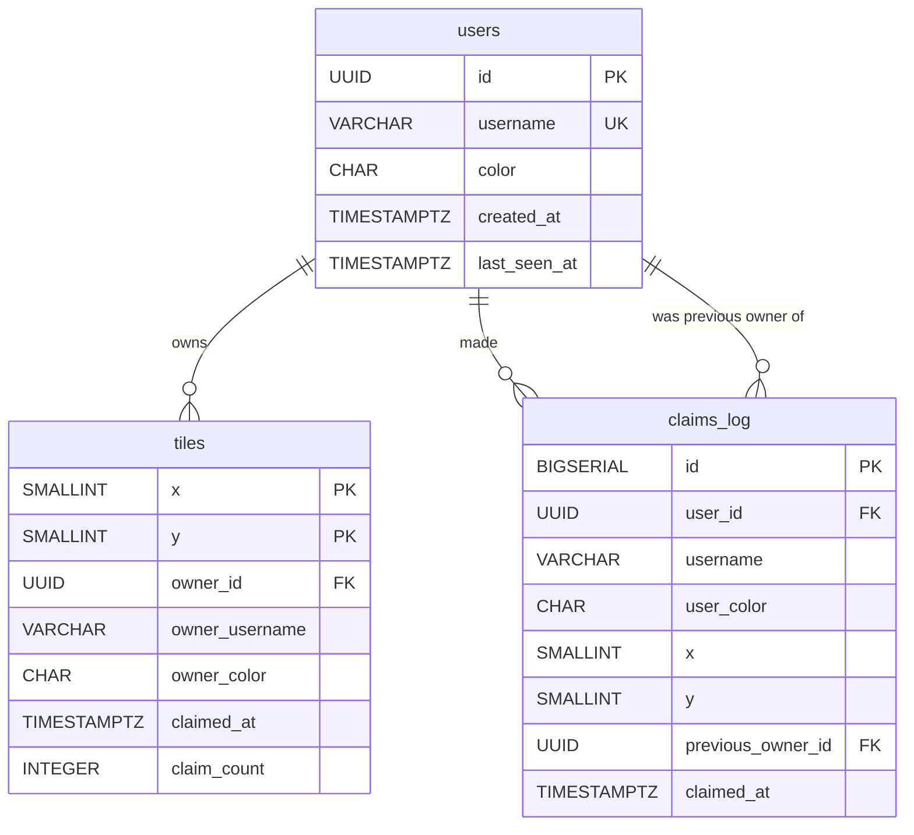

# Database

> **Quick orientation**
> - This file covers the PostgreSQL schema, every query, the migration strategy, and concurrency guarantees.
> - The most important section is **atomic claim query** — it explains why the conflict resolution is correct.
> - For the full end-to-end flow that uses these queries, see [architecture.md](./architecture.md) or [backend.md](./backend.md).

---

## Schema overview



---

## `users` table

```sql
CREATE TABLE IF NOT EXISTS users (
  id           UUID PRIMARY KEY,
  username     VARCHAR(32) UNIQUE NOT NULL,
  color        CHAR(7)    NOT NULL,         -- hex color e.g. "#EF4444"
  created_at   TIMESTAMPTZ DEFAULT NOW(),
  last_seen_at TIMESTAMPTZ DEFAULT NOW()
);

CREATE INDEX IF NOT EXISTS idx_users_last_seen ON users (last_seen_at DESC);
```

**Design decisions:**

- `id UUID PRIMARY KEY` — generated server-side on each new socket connection via `uuidv4()`. Anonymous users get a fresh UUID per session.
- `username VARCHAR(32) UNIQUE` — generated by `unique-names-generator`. Uniqueness is enforced at the DB level, but collisions are handled by `ON CONFLICT DO UPDATE` in `upsertUser`.
- `color CHAR(7)` — stored as a hex string (`#RRGGBB`). Deterministic from the username hash, so the same username always maps to the same color.
- `last_seen_at` — updated on every `upsertUser` call (which runs before each tile claim). Useful for analytics: "active users in last 24h".

---

## `tiles` table

```sql
CREATE TABLE IF NOT EXISTS tiles (
  x              SMALLINT NOT NULL,
  y              SMALLINT NOT NULL,
  owner_id       UUID REFERENCES users(id) ON DELETE SET NULL,
  owner_username VARCHAR(32),
  owner_color    CHAR(7),
  claimed_at     TIMESTAMPTZ,
  claim_count    INTEGER DEFAULT 0,

  PRIMARY KEY (x, y),
  CHECK (x >= 0 AND x < 30),
  CHECK (y >= 0 AND y < 15)
);

CREATE INDEX IF NOT EXISTS idx_tiles_owner
  ON tiles (owner_id) WHERE owner_id IS NOT NULL;

CREATE INDEX IF NOT EXISTS idx_tiles_claimed_at
  ON tiles (claimed_at DESC NULLS LAST);
```

**Design decisions:**

- `PRIMARY KEY (x, y)` — composite key guarantees exactly one row per grid coordinate. No surrogate ID needed.
- **Denormalized `owner_username` and `owner_color`** — these are redundant with the `users` table. They're stored here to avoid a JOIN on every `tile_claimed` broadcast. When the server sends 450 tiles in an `init` payload, each `TileSnapshot` is self-contained with no further lookups.
- `claim_count INTEGER DEFAULT 0` — incremented on every successful claim. Not exposed via the API currently, but available for historical stats.
- `REFERENCES users(id) ON DELETE SET NULL` — if a user row were deleted, their tiles become unclaimed rather than orphaned. In practice, users are never deleted in this implementation.
- **Partial index on `owner_id`** — `WHERE owner_id IS NOT NULL` makes the index smaller (omits unclaimed tiles) and faster for the `clearUserTiles` query which always filters by owner.
- **CHECK constraints** — bounds enforced at the database level as a last line of defense. The application-layer Zod schema validates first, but the DB constraint catches any bypass.

### Grid seeding

The migration seeds all 450 tiles as unclaimed rows:

```sql
INSERT INTO tiles (x, y)
SELECT gx, gy
FROM generate_series(0, 29) AS gx,
     generate_series(0, 14) AS gy
ON CONFLICT (x, y) DO NOTHING;
```

`ON CONFLICT DO NOTHING` makes this idempotent — safe to run on an existing database without wiping claim state.

---

## `claims_log` table

```sql
CREATE TABLE IF NOT EXISTS claims_log (
  id                BIGSERIAL PRIMARY KEY,
  user_id           UUID NOT NULL REFERENCES users(id),
  username          VARCHAR(32) NOT NULL,
  user_color        CHAR(7)    NOT NULL,
  x                 SMALLINT   NOT NULL,
  y                 SMALLINT   NOT NULL,
  previous_owner_id UUID REFERENCES users(id),
  claimed_at        TIMESTAMPTZ DEFAULT NOW()
);

CREATE INDEX IF NOT EXISTS idx_claims_log_recent ON claims_log (claimed_at DESC);
CREATE INDEX IF NOT EXISTS idx_claims_log_user   ON claims_log (user_id, claimed_at DESC);
```

**Design decisions:**

- **Append-only** — rows are only inserted, never updated or deleted. This preserves the full history of every tile transfer.
- **Denormalized `username` and `user_color`** — snapshotted at claim time. If the user's display information changed (hypothetical — usernames are immutable here), the log still reflects what was shown at the moment.
- **`previous_owner_id`** — records who lost the tile. Currently inserted as `NULL` (the handler doesn't look up the previous owner before claiming), but the column is schema-ready for future use.
- **Fire-and-forget** — the `logClaim` call in the claim handler is async and its promise is not awaited for the broadcast:

```typescript
// handlers/claim.ts
logClaim(userId, username, color, x, y, null)
  .catch((err) => console.error('logClaim error', err));

// Then immediately:
io.emit('tile_claimed', result.tile);
```

A failure in `logClaim` does not block the broadcast or cause a client-visible error.

---

## Key queries

### `getAllTiles`

```sql
SELECT x, y, owner_id, owner_username, owner_color, claimed_at::text
FROM tiles
ORDER BY y, x;
```

Returns all 450 tiles in row-major order (top-to-bottom, left-to-right). Called on every socket connection (to populate `init`) and on every `request_snapshot`. The result is the full `TileSnapshot[]` that the client uses to reconstruct its canvas state.

`claimed_at::text` casts the `TIMESTAMPTZ` to ISO 8601 string — avoids JavaScript `Date` object serialization issues.

---

### `atomicClaimTile` — the core query

```sql
UPDATE tiles
SET owner_id       = $1,    -- claiming user's UUID
    owner_username = $2,    -- denormalized username
    owner_color    = $3,    -- denormalized color
    claimed_at     = NOW(),
    claim_count    = claim_count + 1
WHERE x = $4 AND y = $5
  AND (owner_id IS NULL OR owner_id != $1)
RETURNING x, y, owner_id, owner_username, owner_color, claimed_at::text;
```

**Why this query is safe under concurrency:**

Postgres's `UPDATE` statement acquires a row-level lock on the target row. Two concurrent `UPDATE` statements targeting the same tile will serialize — the second one waits until the first commits before evaluating its `WHERE` clause.

```
Timeline: two users claim tile (5,3) simultaneously

Transaction A                          Transaction B
─────────────────────────────────────────────────────
BEGIN                                  BEGIN
UPDATE tiles WHERE x=5 AND y=3        UPDATE tiles WHERE x=5 AND y=3
  → acquires row lock                    → blocks: waiting for A's lock
  → WHERE: owner_id IS NULL → TRUE
  → UPDATE succeeds
  → 1 row affected
COMMIT → row lock released             → lock acquired
                                       → WHERE: owner_id = A's id, A's id ≠ B's id → TRUE
                                       → UPDATE succeeds (tile now owned by B)
                                       → 1 row affected
                                       COMMIT
```

Both transactions succeed here — tile went A→B. This is correct: B's claim arrived after A's committed, so B wins the second race. The key invariant is that **exactly one broadcast is emitted per successful UPDATE** — there is no scenario where both clients receive a `tile_claimed` for the same tile at the same timestamp.

**The `owner_id != $1` clause** handles self-claims: if a user already owns the tile, the WHERE evaluates to FALSE, 0 rows are returned, and the server replies with `claim_rejected { reason: 'self_owned' }`.

---

### `clearUserTiles`

```sql
UPDATE tiles
SET owner_id       = NULL,
    owner_username = NULL,
    owner_color    = NULL,
    claimed_at     = NULL
WHERE owner_id = $1
RETURNING x, y;
```

Atomically nullifies all tiles owned by a user. Returns the coordinates so the server can broadcast `tiles_cleared { owner_id, tiles: [{x,y}, ...] }`.

Note: `claim_count` is NOT reset — it tracks total historical claims, not current ownership.

---

### `upsertUser`

```sql
INSERT INTO users (id, username, color)
VALUES ($1, $2, $3)
ON CONFLICT (username) DO UPDATE
  SET last_seen_at = NOW();
```

Called before every tile claim. Ensures the `users` row exists for the `owner_id` FK in `tiles`. If the username already exists (reconnect, or name collision), the `last_seen_at` timestamp is refreshed.

---

### `logClaim`

```sql
INSERT INTO claims_log (user_id, username, user_color, x, y, previous_owner_id)
VALUES ($1, $2, $3, $4, $5, $6);
```

Simple append. The `previous_owner_id` parameter is currently always `null` — the claim handler doesn't look it up to keep the hot path fast.

---

## Migration strategy

The migration script (`apps/api/scripts/migrate.ts`) runs as the final step of the Railway build, before the server starts.

### Step 1: Apply schema (idempotent)

```typescript
const schemaPath = path.resolve(__dirname, '../../../schema.sql');
await pool.query(fs.readFileSync(schemaPath, 'utf8'));
```

`schema.sql` uses `CREATE TABLE IF NOT EXISTS` and `INSERT ... ON CONFLICT DO NOTHING` throughout. Running it on an existing database with live data is safe — it's a no-op for existing objects.

### Step 2: Normalize grid constraints

```typescript
await pool.query(`DELETE FROM tiles WHERE x >= 30 OR y >= 15`);
await pool.query(`ALTER TABLE tiles DROP CONSTRAINT IF EXISTS tiles_x_check`);
await pool.query(`ALTER TABLE tiles DROP CONSTRAINT IF EXISTS tiles_y_check`);
await pool.query(`ALTER TABLE tiles ADD CONSTRAINT tiles_x_check CHECK (x >= 0 AND x < 30)`);
await pool.query(`ALTER TABLE tiles ADD CONSTRAINT tiles_y_check CHECK (y >= 0 AND y < 15)`);
```

This normalizes constraints in case the database was previously configured with different bounds. The `DROP CONSTRAINT IF EXISTS` prevents failures on fresh databases where the constraint doesn't exist yet.

**Why is migration in the build step, not the start command?**

If migration fails, the build fails — the broken deployment is visible in Railway's build logs and the previous deployment continues serving. If migration were in the start command, a failed migration would crash the server, leaving the service completely down with a less obvious error.

---

## Concurrency guarantees

| Scenario | Guaranteed outcome |
|---|---|
| Two users claim the same tile simultaneously | Exactly one wins (Postgres row-level lock serializes the UPDATEs) |
| User claims tile, then claims same tile again | Second claim is rejected at Redis cooldown (key still set), never reaches Postgres |
| User claims tile, immediately reconnects, then claims same tile | Reconnect issues `request_snapshot`; cooldown key in Redis is still active; second claim rejected |
| Server restarts between claim and broadcast | Claim is durable in Postgres (committed before restart); client re-requests snapshot and sees authoritative state |
| Two users claim different tiles simultaneously | Both succeed — different row locks, no contention |
| Migration runs on a live database | Idempotent — no data loss; constraints are re-created correctly |

---

## Debugging database issues

| Symptom | Where to look |
|---|---|
| `relation "tiles" does not exist` | Migration didn't run or ran in wrong order. Check `migrate.ts` — schema.sql must be applied before any ALTER TABLE. |
| Tile claim succeeds but `RETURNING` gives 0 rows | Self-claim: `owner_id = $1` already. Or constraint violation (x/y out of bounds). |
| `clearUserTiles` returns empty array | User has no tiles, or `owner_id` doesn't match any tile (UUID mismatch — check socket.data.userId). |
| Duplicate username error | `upsertUser` uses `ON CONFLICT (username) DO UPDATE` — should not error. If it does, `username` constraint may be on `id` instead. Check schema. |
| `claimed_at` is null for owned tiles | `claim_count > 0` but `claimed_at = NULL` means a manual SQL update was run without setting `claimed_at`. Unlikely in production. |
| Connection pool exhausted | All 10 pool slots in use — probably a query is hanging (check for uncommitted transactions). Run `SELECT * FROM pg_stat_activity WHERE state != 'idle'` on Supabase. |
