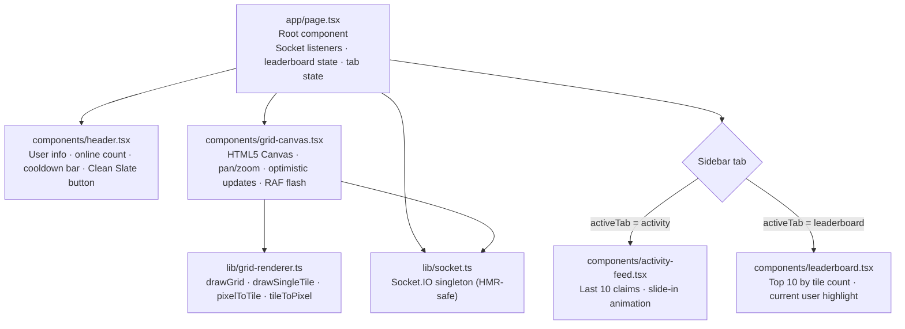
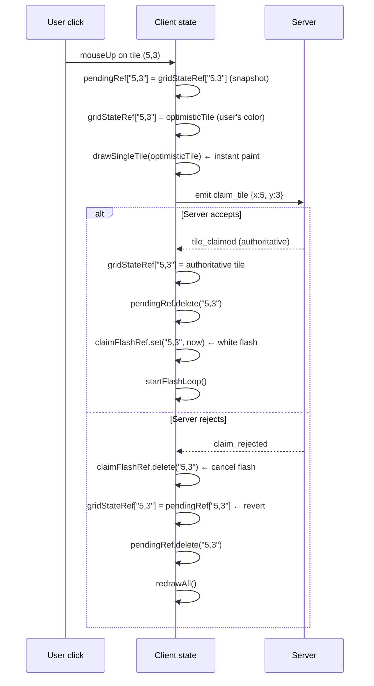

# Frontend

> **Quick orientation**
> - This file covers everything inside `apps/web/` — the Next.js app, canvas rendering engine, state management, animations, and UI components.
> - Start with the component hierarchy, then the canvas engine section if you're debugging rendering issues.
> - For socket event contracts, see [websocket.md](./websocket.md). For the full claim sequence, see [architecture.md](./architecture.md).

---

## Component hierarchy



**State ownership:**

| State | Lives in | Why |
|---|---|---|
| `user`, `onlineCount` | `page.tsx` useState | Shared across Header and GridCanvas |
| `recentClaims` | `page.tsx` useState | ActivityFeed is a pure presentational component |
| `leaderEntries` | `page.tsx` useState | Derived from refs, flushed here |
| `activeTab` | `page.tsx` useState | Controls sidebar tab render |
| `showLeaveModal` | `page.tsx` useState | Modal visibility |
| `gridStateRef` | `grid-canvas.tsx` useRef | High-frequency mutations — state would re-render every claim |
| `tileOwnersRef`, `leaderMapRef` | `page.tsx` useRef | Mutated in-place, flushed to state via `flushLeaderboard` |
| `claimFlashRef`, `flashRafRef` | `grid-canvas.tsx` useRef | RAF loop — must not trigger re-renders |
| `transformRef`, `hoverRef` | `grid-canvas.tsx` useRef | Mutated on every mouse event — cannot be state |

---

## Socket.IO singleton

`lib/socket.ts` exports a single `getSocket()` function that returns the same Socket.IO client instance for the entire app lifetime.

```typescript
let socket: AppSocket | null = null;

function createSocket(): AppSocket {
  return io(process.env.NEXT_PUBLIC_API_URL ?? 'http://localhost:4000', {
    transports: ['polling', 'websocket'],  // polling first: works through proxies
    autoConnect: true,
    reconnection: true,
    reconnectionAttempts: Infinity,        // never stop trying
    reconnectionDelay: 1000,              // 1s initial backoff
    reconnectionDelayMax: 5000,           // 5s cap (exponential)
  });
}

export function getSocket(): AppSocket {
  if (socket) return socket;

  // In dev, store the socket on window so Next.js HMR doesn't create a second connection
  if (typeof window !== 'undefined' && process.env.NODE_ENV === 'development') {
    const win = window as { __tilewar_socket?: AppSocket };
    if (win.__tilewar_socket) {
      socket = win.__tilewar_socket;
      return socket;
    }
  }

  socket = createSocket();

  if (typeof window !== 'undefined' && process.env.NODE_ENV === 'development') {
    (window as { __tilewar_socket?: AppSocket }).__tilewar_socket = socket;
  }

  return socket;
}
```

**Why the window caching in dev?** Next.js HMR re-executes module code when a file changes. Without the cache, each hot reload creates a new Socket.IO connection — the old one is disconnected by the server, and you end up with ghost users. Storing the instance on `window` survives the module re-execution.

**Why `Infinity` reconnection attempts?** Users leave tabs open. A tab open for an hour should reconnect silently when the server restarts, not show a permanently broken state.

---

## Canvas engine

The canvas is a full-DOM `<canvas>` element managed by `grid-canvas.tsx`. All rendering happens via the 2D context API — React never touches the canvas pixels.

### Transform model

Every pan and zoom operation is expressed as a `Transform`:

```typescript
// lib/grid-renderer.ts
export interface Transform {
  scale: number;    // zoom level (1.0 = natural size, 0.3 = zoomed out, 5 = zoomed in)
  offsetX: number;  // horizontal pan offset in canvas pixels
  offsetY: number;  // vertical pan offset in canvas pixels
}
```

Coordinate conversions:

```typescript
// Pixel (mouse position) → Tile grid coordinate
export function pixelToTile(
  canvasX: number,
  canvasY: number,
  transform: Transform
): { x: number; y: number } | null {
  const tileX = Math.floor((canvasX - transform.offsetX) / (TILE_SIZE * transform.scale));
  const tileY = Math.floor((canvasY - transform.offsetY) / (TILE_SIZE * transform.scale));
  if (tileX < 0 || tileX >= GRID_COLS || tileY < 0 || tileY >= GRID_ROWS) return null;
  return { x: tileX, y: tileY };
}

// Tile grid coordinate → Pixel (top-left corner of tile on canvas)
export function tileToPixel(
  tileX: number,
  tileY: number,
  transform: Transform
): { px: number; py: number } {
  return {
    px: tileX * TILE_SIZE * transform.scale + transform.offsetX,
    py: tileY * TILE_SIZE * transform.scale + transform.offsetY,
  };
}
```

### Full grid redraw

`drawGrid` is called whenever the whole canvas needs updating: on pan, zoom, hover change, tile clear, and reconnect.

```typescript
export function drawGrid(
  ctx: CanvasRenderingContext2D,
  gridState: Map<string, TileSnapshot>,
  transform: Transform,
  hoverTile: { x: number; y: number } | null
): void {
  const { scale, offsetX, offsetY } = transform;
  const tilePixels = TILE_SIZE * scale;

  // Black fill creates the grid lines — tiles stop 1px short, background shows through
  ctx.fillStyle = '#000000';
  ctx.fillRect(0, 0, ctx.canvas.width, ctx.canvas.height);

  for (let y = 0; y < GRID_ROWS; y++) {
    for (let x = 0; x < GRID_COLS; x++) {
      const px = x * tilePixels + offsetX;
      const py = y * tilePixels + offsetY;

      // Viewport culling — skip tiles fully outside the visible area
      // This matters at high zoom when most tiles are offscreen
      if (px + tilePixels < 0 || px > ctx.canvas.width) continue;
      if (py + tilePixels < 0 || py > ctx.canvas.height) continue;

      const tile = gridState.get(`${x},${y}`);
      ctx.fillStyle = tile?.owner_color ?? '#EBEBEB';  // gray for unclaimed
      ctx.fillRect(px, py, tilePixels - 1, tilePixels - 1);  // -1 = 1px gap for grid lines

      if (hoverTile?.x === x && hoverTile?.y === y) {
        ctx.fillStyle = 'rgba(0,0,0,0.15)';  // 15% black overlay on hover
        ctx.fillRect(px, py, tilePixels - 1, tilePixels - 1);
      }
    }
  }
}
```

### Single tile redraw

`drawSingleTile` is used for the optimistic update (immediate paint on click, before server response). It redraws only one tile — much faster than a full redraw.

```typescript
export function drawSingleTile(
  ctx: CanvasRenderingContext2D,
  tile: TileSnapshot,
  transform: Transform,
  isHovered = false
): void {
  const tilePixels = TILE_SIZE * transform.scale;
  const px = tile.x * tilePixels + transform.offsetX;
  const py = tile.y * tilePixels + transform.offsetY;

  ctx.fillStyle = tile.owner_color ?? '#EBEBEB';
  ctx.fillRect(px, py, tilePixels - 1, tilePixels - 1);

  if (isHovered) {
    ctx.fillStyle = 'rgba(0,0,0,0.15)';
    ctx.fillRect(px, py, tilePixels - 1, tilePixels - 1);
  }
}
```

### Initial fit-to-screen

On first load, the grid is centered and scaled to fit the viewport:

```typescript
if (!centeredRef.current) {
  centeredRef.current = true;
  const scaleToFit = Math.min(
    rect.width  / (GRID_COLS * TILE_SIZE),  // scale that fits width
    rect.height / (GRID_ROWS * TILE_SIZE),  // scale that fits height
    1                                        // never upscale (tiles stay crisp)
  );
  const gridW = GRID_COLS * TILE_SIZE * scaleToFit;
  const gridH = GRID_ROWS * TILE_SIZE * scaleToFit;
  transformRef.current = {
    scale: scaleToFit,
    offsetX: (rect.width  - gridW) / 2,  // center horizontally
    offsetY: (rect.height - gridH) / 2,  // center vertically
  };
}
```

`centeredRef` is a one-shot flag. Resizing the window calls `resize()` again, but `centeredRef.current` is already `true` so the transform is preserved.

---

## Interaction model

```
mouseDown ──────────► panRef.isDragging = true
                       startX, startY, startOffX, startOffY captured

mouseMove (dragging) ► dx = clientX - startX
                       transformRef.offsetX = startOffX + dx
                       redrawAll()

mouseMove (hover) ───► pixelToTile(canvasX, canvasY, transform)
                       if tile changed → hoverRef = tile
                       if RAF not running → redrawAll()
                       (if RAF running, it already redraws every frame)

mouseUp (drag > 4px) ► panRef.isDragging = false, return

mouseUp (click) ─────► pixelToTile → tile
                       snapshot pendingRef[key] = current gridState
                       gridState[key] = optimisticTile
                       drawSingleTile(optimisticTile)
                       socket.emit claim_tile {x, y}

wheel ───────────────► factor = deltaY < 0 ? 1.1 : 0.9
                       newScale = clamp(scale * factor, 0.3, 5)
                       offsetX -= mouseX * (scaleDelta / scale)  ← zoom toward cursor
                       offsetY -= mouseY * (scaleDelta / scale)
                       redrawAll()

mouseLeave ──────────► hoverRef = null
                       if RAF not running → redrawAll()
```

**Why the RAF guard on hover/leave?** When the flash animation is running, `requestAnimationFrame` calls `redrawAll()` every ~16ms already. Calling it again from mouse events would cause double-draws on the same frame. The guard `if (flashRafRef.current === null)` avoids this.

**Why drag threshold of 4px?** Without it, a tiny hand tremor on click would be interpreted as a drag, suppressing the claim. 4px is enough to distinguish intentional drag from click noise.

---

## Optimistic UI



The optimistic tile and the authoritative tile are visually identical for a claim by the current user — same color, same coordinates. The only case where the user sees a visual change on rejection is if they attempted to claim a tile that already belonged to them (`self_owned`) and the optimistic paint momentarily cleared the tile display (it doesn't — the tile stays their color).

---

## RAF flash animation

The flash animation runs in a `requestAnimationFrame` loop that starts when a tile is claimed and stops automatically when all flashes expire.

```typescript
// Inside the useEffect in grid-canvas.tsx

const startFlashLoop = () => {
  if (flashRafRef.current !== null) return;  // loop already running

  const tick = (now: DOMHighResTimeStamp) => {
    redrawAll();  // draw the base grid (all tiles, hover state)

    const ctx = getCtx();
    let hasActive = false;

    if (ctx) {
      for (const [key, startTs] of claimFlashRef.current) {
        const elapsed = now - startTs;
        if (elapsed >= 400) {
          claimFlashRef.current.delete(key);  // flash expired
          continue;
        }
        hasActive = true;

        // Linear fade: alpha starts at 0.7, reaches 0 at 400ms
        const alpha = (1 - elapsed / 400) * 0.7;
        const [tx, ty] = key.split(',').map(Number);
        const { px, py } = tileToPixel(tx, ty, transformRef.current);
        const tilePixels = TILE_SIZE * transformRef.current.scale;

        ctx.fillStyle = `rgba(255,255,255,${alpha})`;
        ctx.fillRect(px, py, tilePixels - 1, tilePixels - 1);
      }
    }

    if (hasActive) {
      flashRafRef.current = requestAnimationFrame(tick);  // continue loop
    } else {
      flashRafRef.current = null;
      redrawAll();  // one clean final frame with no overlays
    }
  };

  flashRafRef.current = requestAnimationFrame(tick);
};
```

**Why `requestAnimationFrame` and not `setTimeout`?** RAF synchronizes with the display refresh rate (typically 60fps). `setTimeout(fn, 16)` can drift and cause visible tearing. RAF also pauses automatically when the tab is backgrounded — when the user returns, `now - startTs` will be > 400ms for all entries, so they're all cleaned up immediately.

**Why alpha `(1 - elapsed/400) * 0.7` and not `1 - elapsed/400`?** Starting at 70% opacity instead of 100% makes the flash feel less harsh — a brief bright flicker rather than a full white-out.

**Multiple simultaneous flashes:** `claimFlashRef` is a Map, so multiple tiles can be in-flight at once. The loop processes all of them per frame. The loop runs as long as at least one is active.

---

## Leaderboard state pattern

The leaderboard aggregates tile ownership counts from socket events — no backend queries.

```typescript
// page.tsx

// tileOwnersRef: "x,y" → current owner info
// Needed to know the PREVIOUS owner when a tile changes hands
const tileOwnersRef = useRef<Map<string, { ownerId: string; username: string; color: string } | null>>(
  new Map()
);

// leaderMapRef: ownerId → { username, color, tileCount }
// Mutated in-place on every tile_claimed event
const leaderMapRef = useRef<Map<string, { username: string; color: string; tileCount: number }>>(
  new Map()
);

// Converts refs to sorted React state — called once per event, not per mutation
const flushLeaderboard = useCallback(() => {
  const entries = Array.from(leaderMapRef.current.entries())
    .filter(([, v]) => v.tileCount > 0)          // exclude users at 0
    .map(([ownerId, v]) => ({ ownerId, ...v }))
    .sort((a, b) => b.tileCount - a.tileCount)    // descending
    .slice(0, 10);                                 // top 10 only
  setLeaderEntries(entries);
}, []);
```

On `tile_claimed`:
```typescript
const handleTileClaimedForLeader = (tile: TileSnapshot) => {
  if (!tile.owner_id) return;  // TypeScript: owner_id is string|null; tile_claimed always has one

  const key = `${tile.x},${tile.y}`;
  const prevOwner = tileOwnersRef.current.get(key);

  // Decrement the previous owner's count (if tile was owned and changed hands)
  if (prevOwner && prevOwner.ownerId !== tile.owner_id) {
    const prevEntry = leaderMapRef.current.get(prevOwner.ownerId);
    if (prevEntry) prevEntry.tileCount = Math.max(0, prevEntry.tileCount - 1);
  }

  // Increment new owner's count
  const newEntry = leaderMapRef.current.get(tile.owner_id);
  if (newEntry) {
    newEntry.tileCount++;
    newEntry.username = tile.owner_username!;  // update in case they reconnected
    newEntry.color = tile.owner_color!;
  } else {
    leaderMapRef.current.set(tile.owner_id, {
      username: tile.owner_username!,
      color: tile.owner_color!,
      tileCount: 1,
    });
  }

  tileOwnersRef.current.set(key, {
    ownerId: tile.owner_id,
    username: tile.owner_username!,
    color: tile.owner_color!,
  });

  flushLeaderboard();  // single React state update
};
```

**Why refs, not state?** If `leaderMapRef` were `useState`, every `tile_claimed` event from any user would trigger a React render on every client. With refs, mutations are free — only `flushLeaderboard()` triggers a render.

---

## Activity feed

```typescript
// components/activity-feed.tsx

// Key is content-based, not index-based.
// When a new claim arrives at position 0, React sees a new key → new DOM node → animation fires.
// If key were the index, React would reuse the existing node → no animation.
{claims.map((claim, i) => (
  <li
    key={`${claim.x},${claim.y},${claim.claimed_at ?? i}`}
    className="feed-item-enter"  // triggers slideInRight keyframe on mount
  >
    ...
  </li>
))}
```

The animation is defined in `globals.css`:
```css
@keyframes slideInRight {
  from { opacity: 0; transform: translateX(20px); }
  to   { opacity: 1; transform: translateX(0); }
}
.feed-item-enter { animation: slideInRight 0.18s ease-out forwards; }
```

`timeAgo` formats relative timestamps:
```typescript
function timeAgo(isoString: string | null): string {
  if (!isoString) return '';
  const ms = Date.now() - new Date(isoString).getTime();
  if (ms < 5000) return 'just now';
  if (ms < 60_000) return `${Math.floor(ms / 1000)}s ago`;
  return `${Math.floor(ms / 60_000)}m ago`;
}
```

Note: `timeAgo` is called at render time, not on an interval. The relative times only update when new claims arrive (triggering a re-render). This is acceptable since the feed shows recent activity and refreshes frequently.

---

## "Clean Slate" modal

The leave modal is shown when a user tries to close the tab and then stays.

```typescript
// page.tsx
useEffect(() => {
  let leavingFlag = false;

  const onBeforeUnload = (e: BeforeUnloadEvent) => {
    leavingFlag = true;
    e.preventDefault();
    e.returnValue = '';  // triggers browser "Leave / Stay?" dialog
  };

  // When the window regains focus after a beforeunload event,
  // the user chose "Stay" — show the clean slate modal.
  const onFocus = () => {
    if (leavingFlag) {
      leavingFlag = false;
      setShowLeaveModal(true);
    }
  };

  window.addEventListener('beforeunload', onBeforeUnload);
  window.addEventListener('focus', onFocus);
  return () => {
    window.removeEventListener('beforeunload', onBeforeUnload);
    window.removeEventListener('focus', onFocus);
  };
}, []);
```

**Why `focus` after `beforeunload`?** The browser fires `beforeunload` before showing the "Leave / Stay" dialog. If the user clicks "Leave," the tab is closed — no further events. If they click "Stay," the window regains focus and fires the `focus` event. `leavingFlag` distinguishes a normal focus (false) from a post-beforeunload focus (true).

---

## Cooldown indicator

`header.tsx` shows a progress bar that fills over 3 seconds after each successful claim.

```typescript
const COOLDOWN_MS = 3000;

useEffect(() => {
  if (!lastClaimTime) { setElapsed(0); return; }
  setElapsed(0);
  const interval = setInterval(() => {
    const e = Date.now() - lastClaimTime;
    setElapsed(e);
    if (e >= COOLDOWN_MS) clearInterval(interval);
  }, 50);  // 50ms interval = smooth enough without excess renders
  return () => clearInterval(interval);
}, [lastClaimTime]);

const progress = onCooldown ? elapsed / COOLDOWN_MS : 1;  // 0→1 over 3s
```

The indicator is advisory only — the server enforces the cooldown independently. A user can claim from another browser tab before this bar fills.

---

## Debugging frontend issues

| Symptom | Where to look |
|---|---|
| Grid not rendering | `canvasRef` — check `canvas.width` / `canvas.height` are non-zero. `resize()` depends on `canvas.parentElement.getBoundingClientRect()`. |
| Tile shows wrong color | `gridStateRef` — log `gridStateRef.current.get("x,y")` after `tile_claimed`. Check if `drawSingleTile` is clobbering a `redrawAll` or vice versa. |
| Flash animation never stops | `flashRafRef.current` — check RAF cleanup in useEffect return: `cancelAnimationFrame(flashRafRef.current)`. |
| Leaderboard count wrong | `tileOwnersRef` — check the previous owner lookup. If `tileOwnersRef.get(key)` returns `undefined` (not `null`), the tile was never tracked. Ensure `handleInit` populates the ref for all 450 tiles. |
| Activity feed not animating | Check key prop — must be `x,y,claimed_at`, not index. Check `feed-item-enter` class exists in `globals.css`. |
| Socket connects but no `init` received | React StrictMode double-invoke — effect cleanup runs before `init` arrives. The `if (socket.connected) socket.emit('request_snapshot')` guard at end of effect handles this. |
| Zoom not centered on cursor | The zoom formula: `offsetX -= mouseX * (scaleDelta / scale)`. If `scaleDelta` is wrong (e.g. clamped incorrectly), the zoom pivots on the wrong point. |
