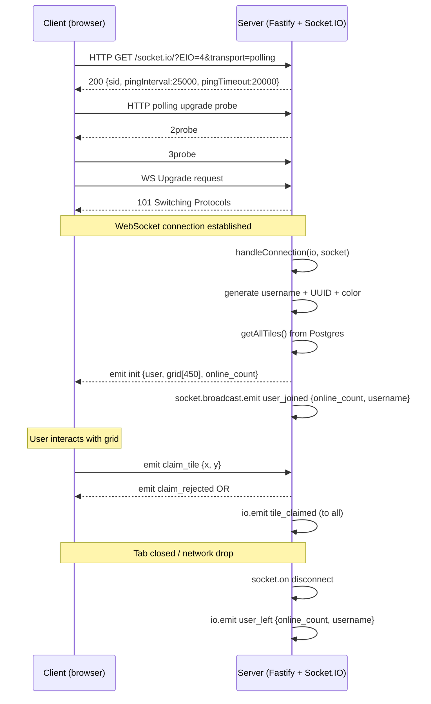

# WebSocket Protocol

> **Quick orientation**
> - This file is the authoritative reference for every socket event in the system.
> - Read it when you need to understand what data flows between client and server, or when adding a new event.
> - For the full claim lifecycle sequence, see [architecture.md](./architecture.md).
> - The canonical type definitions live in `packages/types/index.ts`.

---

## Transport negotiation

Socket.IO starts with HTTP long-polling and upgrades to a WebSocket connection once the handshake succeeds. This is intentional — polling works in environments where WebSocket connections are blocked (corporate proxies, some mobile carriers).

```
Client                                    Server
  │                                          │
  │── GET /socket.io/?EIO=4&transport=polling ──►│  HTTP 200 (handshake)
  │◄── {sid, upgrades:["websocket"], ...} ──────│
  │                                          │
  │── GET /socket.io/?transport=polling ────────►│  Long-poll open
  │◄── 2probe (ping from server) ───────────────│
  │── 3probe (pong from client) ─────────────►  │
  │                                          │
  │── WS Upgrade: /socket.io/?transport=websocket │  HTTP 101 Switching
  │◄── 101 Switching Protocols ─────────────────│
  │                                          │
  │◄──── WS frames from here on ─────────────►  │
```

**Server config** (`apps/api/src/server.ts`):
```typescript
const io = new SocketIOServer(app.server, {
  transports: ['websocket', 'polling'],  // accepts both
  perMessageDeflate: true,               // gzip compression on WS frames
});
```

**Client config** (`apps/web/lib/socket.ts`):
```typescript
io(NEXT_PUBLIC_API_URL, {
  transports: ['polling', 'websocket'],  // polling first for reliability
  autoConnect: true,
  reconnection: true,
  reconnectionAttempts: Infinity,
  reconnectionDelay: 1000,
  reconnectionDelayMax: 5000,
});
```

If WebSocket is unavailable, the connection stays on polling permanently. The application works identically — slightly higher latency, slightly more bandwidth.

---

## Connection lifecycle



---

## Event reference

### Server → Client (received by browser)

---

#### `init`

Emitted once on connect, and again in response to `request_snapshot`.

```typescript
interface InitPayload {
  user: {
    id: string;        // UUID — stable for this socket session
    username: string;  // e.g. "quiet-ferret-42" — generated on connect
    color: string;     // hex e.g. "#EF4444" — deterministic hash of username
  };
  grid: Array<{
    x: number;
    y: number;
    owner_id: string | null;
    owner_username: string | null;
    owner_color: string | null;
    claimed_at: string | null;  // ISO 8601
  }>;
  online_count: number;
}
```

**Client behaviour on receipt:**
- `grid-canvas.tsx`: clears `gridStateRef`, repopulates from grid, calls `redrawAll()`
- `page.tsx`: sets `user` state, sets `onlineCount` state, rebuilds `tileOwnersRef` + `leaderMapRef`, calls `flushLeaderboard()`

**Edge case:** In React StrictMode (dev), effects run twice. If the socket connects very fast, the `init` event fires before the second effect run registers the handler. The fix: `if (socket.connected) socket.emit('request_snapshot')` at the end of the effect.

---

#### `tile_claimed`

Broadcast to ALL connected clients after a successful claim. This is the authoritative state — clients must patch their grid to match exactly.

```typescript
interface TileClaimedPayload {
  x: number;
  y: number;
  owner_id: string;        // always non-null — claims always have an owner
  owner_username: string;
  owner_color: string;
  claimed_at: string;      // ISO 8601, server time
}
```

**Client behaviour (`grid-canvas.tsx`):**
```typescript
const handleTileClaimed = (tile: TileSnapshot) => {
  const key = `${tile.x},${tile.y}`;
  gridStateRef.current.set(key, tile);       // patch grid state
  pendingRef.current.delete(key);            // clear any pending optimistic update
  claimFlashRef.current.set(key, performance.now()); // start flash
  startFlashLoop();
  onTileClaimed(tile);                       // update activity feed
};
```

**Client behaviour (`page.tsx` — leaderboard):**
```typescript
const handleTileClaimedForLeader = (tile: TileSnapshot) => {
  if (!tile.owner_id) return;  // guard: tile_claimed always has owner, but type says nullable
  // decrement previous owner, increment new owner, flush leaderboard
};
```

---

#### `claim_rejected`

Private — sent only to the socket that made the rejected claim. Other clients never see this.

```typescript
interface ClaimRejectedPayload {
  x: number;
  y: number;
  reason: 'cooldown' | 'self_owned' | 'invalid_coords' | 'rate_limit';
  cooldown_remaining_ms?: number;  // only present when reason === 'cooldown'
}
```

| Reason | Cause | Client action |
|---|---|---|
| `cooldown` | Per-user Redis key still set | Revert optimistic tile, show remaining time in cooldown bar |
| `self_owned` | Tile already owned by this user | Revert optimistic tile (no visual change since it was already your color) |
| `invalid_coords` | x/y out of 0–29 / 0–14 range | Should not happen via normal UI — revert and log |
| `rate_limit` | >20 messages in 5 seconds | Revert tile — user is spamming |

**Client behaviour (`grid-canvas.tsx`):**
```typescript
const handleClaimRejected = (payload) => {
  const key = `${payload.x},${payload.y}`;
  claimFlashRef.current.delete(key);  // cancel flash before it starts
  if (!pendingRef.current.has(key)) return;
  const prev = pendingRef.current.get(key);
  pendingRef.current.delete(key);
  if (prev === null) {
    gridStateRef.current.delete(key);  // was empty — restore empty
  } else {
    gridStateRef.current.set(key, prev); // had an owner — restore them
  }
  redrawAll();
};
```

---

#### `user_joined`

Broadcast to all OTHER clients when a new socket connects.

```typescript
interface UserJoinedPayload {
  online_count: number;
  username: string;
}
```

Client updates `onlineCount` state (displayed in header). Username is informational only — not shown in UI currently but available for a "joined" toast.

---

#### `user_left`

Broadcast to ALL clients when a socket disconnects.

```typescript
interface UserLeftPayload {
  online_count: number;
  username: string;
}
```

Client updates `onlineCount` state. Note: tiles are NOT automatically cleared on disconnect — that only happens if the user explicitly clicks "CLEAN MY TILES" in the leave modal.

---

#### `tiles_cleared`

Broadcast to ALL clients when a user clears their tiles (via "Clean Slate").

```typescript
interface TilesClearedPayload {
  owner_id: string;
  tiles: Array<{ x: number; y: number }>;
}
```

**Client behaviour (`grid-canvas.tsx`):** deletes each tile key from `gridStateRef`, calls `redrawAll()`.

**Client behaviour (`page.tsx` — leaderboard):**
```typescript
const handleTilesClearedForLeader = (payload) => {
  for (const { x, y } of payload.tiles) {
    const key = `${x},${y}`;
    const prevOwner = tileOwnersRef.current.get(key);
    if (prevOwner) {
      const entry = leaderMapRef.current.get(prevOwner.ownerId);
      if (entry) entry.tileCount = Math.max(0, entry.tileCount - 1);
    }
    tileOwnersRef.current.set(key, null);
  }
  flushLeaderboard();
};
```

---

#### `error`

Generic server-side error. Currently emitted for Zod validation failures on unexpected payloads.

```typescript
interface ErrorPayload {
  message: string;
  code?: string;
}
```

---

### Client → Server (sent by browser)

---

#### `claim_tile`

Request to claim a tile. Server validates, applies, and either broadcasts `tile_claimed` or replies with `claim_rejected`.

```typescript
interface ClaimTilePayload {
  x: number;  // 0 ≤ x < 30
  y: number;  // 0 ≤ y < 15
}
```

Never send this for a tile the user already owns — the server will `claim_rejected` with `self_owned`, but it wastes a cooldown window.

---

#### `request_snapshot`

Request a fresh `init` payload. Server replies with the full grid state from Postgres. No payload.

Used in two cases:
1. After reconnect (Socket.IO fires this automatically via the effect cleanup/re-run)
2. When the effect runs but `socket.connected` is already true (StrictMode, fast localhost)

```typescript
// apps/web/app/page.tsx
if (socket.connected) {
  socket.emit('request_snapshot');
}
```

---

#### `clear_my_tiles`

Request to null out all tiles owned by this user. No payload. Server responds with a `tiles_cleared` broadcast if any tiles were cleared.

Emitted by the "CLEAN MY TILES" button in the leave modal.

---

## Reconnection behaviour

Socket.IO handles reconnection automatically. The backoff schedule:

| Attempt | Delay |
|---|---|
| 1 | 1000 ms |
| 2 | 2000 ms |
| 3 | 4000 ms |
| 4+ | 5000 ms (capped by `reconnectionDelayMax`) |

`reconnectionAttempts: Infinity` means the client will keep trying indefinitely. This is correct for a real-time game — users may leave a tab open for hours and expect it to resume when they return.

**State during disconnect window:**

While disconnected, the client renders whatever was in `gridStateRef` when the socket dropped. Other users' claims during this window are missed. When the connection resumes and `request_snapshot` fires, the server sends authoritative state and the client reconciles — any discrepancies are corrected instantly.

---

## Rate limits

Two independent limits protect the server:

### Per-socket (in-memory, sliding window)

```typescript
// apps/api/src/handlers/claim.ts
const RATE_WINDOW_MS = 5_000;
const RATE_MAX_MSGS = 20;

function isRateLimited(socket: AppSocket): boolean {
  const now = Date.now();
  // Discard timestamps outside the 5s window
  socket.data.msgTimestamps = socket.data.msgTimestamps.filter(
    (t) => now - t < RATE_WINDOW_MS
  );
  if (socket.data.msgTimestamps.length >= RATE_MAX_MSGS) return true;
  socket.data.msgTimestamps.push(now);
  return false;
}
```

This limit is per socket (per browser tab). It is stored in `socket.data` — no Redis, no database. If the socket reconnects, the counter resets. It protects against scripted message floods.

### Per-user (Redis, cooldown-based)

```typescript
// apps/api/src/lib/redis.ts
const COOLDOWN_TTL_S = 3;

const result = await redis.set(
  `cooldown:user:${userId}`, '1', 'EX', COOLDOWN_TTL_S, 'NX'
);
```

This limit is per user UUID, stored in Redis with a 3-second TTL. It survives socket reconnects and persists across server restarts. The `cooldown_remaining_ms` value returned on rejection is read via `PTTL` (millisecond-precision TTL).

The client header shows a **visual indicator only** — it is advisory, not a gate. The server enforces the cooldown independently.

---

## Adding a new event

1. Add the TypeScript interface to `packages/types/index.ts` under the correct direction (`ServerToClientEvents` or `ClientToServerEvents`).
2. Run `npm run build` in `packages/types` to generate the dist.
3. On the server: `socket.on('new_event', handler)` or `io.emit('new_event', payload)`.
4. On the client: `socket.on('new_event', handler)` inside the `useEffect` in `page.tsx` or `grid-canvas.tsx`, with the corresponding `socket.off` in the cleanup return.
5. If the event mutates tile state, update `tileOwnersRef` and `leaderMapRef` in `page.tsx` and call `flushLeaderboard()`.

---

## Debugging socket events

**In browser DevTools (Network tab → WS):**
Every Socket.IO message is visible as a WS frame. The format is `42["event_name", payload]` — `4` = message type, `2` = Socket.IO namespace, then the event array.

**On the server:**
Add `console.log` before and after each `io.emit` / `socket.emit` call. Fastify's logger is at `INFO` level by default — lower it to `DEBUG` for Socket.IO internals: `Fastify({ logger: { level: 'debug' } })`.

| Symptom | Check |
|---|---|
| Client never receives `init` | Is `socket.connected` true? Is the CORS origin in `FRONTEND_URL`? |
| `claim_rejected` with reason `cooldown` immediately | Redis cooldown key from a previous session — wait 3s or flush Redis |
| `tile_claimed` reaches server but not all clients | Redis adapter pub/sub — is `REDIS_URL` set on all instances? |
| Events fire twice in dev | React StrictMode double-invokes effects — the `socket.off` cleanup prevents duplicate handlers |
